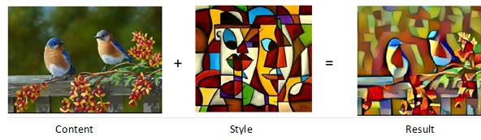

# Style Transfer

### About This Demo Application
In this Style Transfer Demo, we demonstrate the workings of an iterative procedure that transfers the style from one image to the contents of another image, e.g. something like this…



Style Transfer works by starting with an array which is just random noise, and applies two loss functions to it – a Style Loss Function that gets the image closer and closer in Style to the Image whose style we want to match, and a Content Loss Function that gets the image closer and closer to an image whose Content or looks we want to match. As we minimize this joint loss function, the result is an image which has the content of the Content image and style of the Style image

Please look at the notebook in the rorodata github repository [here](https://github.com/rorodata/style-transfer-demo/blob/master/notebooks/Style_Transfer_NB.ipynb) for more details.

### Productionizing Machine Learning Models Using rorodata 
Below, we discuss how a data scientist can deploy and manage data science models in production using rorodata platform, with just a few simple lines of command from a CLI. In this writeup, we shall illustrate this using Python, a similar write-up for R is on the way. 

There is a lot that goes on behind the scenes in the rorodata platform. It may be hard to appreciate the demo without some understanding of this. For a quick, high level view of the rorodata platform and it's workings, [go here](https://github.com/rorodata/documents/blob/master/about-rorodata.md)


#### Prerequisites
- Download roro client for python3 using `pip install roro-client`. Note that currently, we only support python 3.5 and above.
- You must have a rorodata platform account, as the models will be deployed on rorodata platform for this example. You may request access [here](http://www.rorodata.com). 

#### Steps (code only)
```
> git clone https://github.com/rorodata/style-transfer-demo.git
> cd style-transfer-demo

# NOTE: edit roro.yml to change project name to name of new project, I am using the project name style-transfer for this example
> roro create style-transfer
Created project: style-transfer

> roro deploy
Deploying project style-transfer. This may take a few moments ...
Restarted one service.
default: https://style-transfer.rorocloud.io/

```


#### Steps (verbose)
1.	Clone the code repository rorodata/credit-scoring-demo (manually or using git) and download the files to a local directory. You will shortly deploy this repository on rorocloud as your own project.
2.	Pick a unique project name for the project you are about to create on the data platform. Remember to keep a short readable name without spaces or special characters (hyphen is ok). 
3.	Edit the roro.yml file, and change the part after project: to match your project name exactly, and save it. The roro.yml is a simple text file that tells the rorodata platform what to do during deployment. You can understand more about the structure and specifications that can go into the YML file here 
4.	You will now deploy code from the local repository you just edited, into production on rorodata platform.  Navigate to the above mentioned repository using command prompt. From here, login to the rorodata platform using roro login from command prompt. You are now using roro client connected to rorodata platform. Send us an email if you run into any issues and we shall help you out quickly
5.	Create your (new) project using the command roro create your-project-name. Remember to us the same name you picked in step 2,3. Remember, this project is the entire machine learning application including its code, all associated tasks and services, persistent data volumes, and ML models. Once done, you can use the command roro projects to view a list of all your projects. Make sure that you can see the project you just created.
6.	You are now ready to deploy your project code to production. From the same command prompt location as in the previous step, type roro deploy and press enter. This When a project is deployed, rorodata takes its cue from the roro.yml file and execute deployment steps one by one. You can see a list / trace of all these steps once roro deploy finishes.
7.	Your services should now be ready and serving, with URL endpoints for each service as instructed by you in the roro.yml file.   You can check if the service is running using the command roro ps –a.  
9.	The rorodata platform services are REST-APIs, and can be accessed using any client service. The easiest way to test this is through our firefly library. You can install this using `pip install firefly-python` and query the service using the same example as in the notebook
10.	Let’s now use the API we created, to do some style transfer


```

#we will use firefly to call our API, you can use any other library e.g. Requests
> import firefly

#change the below statement to match your prediction service api name
> style_api=firefly.Client("https://style-transfer.rorocloud.io/")

> content_file=open('two_birds.jpg', "rb"), format='jpg'))
> style_file=open('picasso.jpg', "rb"), format='jpg'))
> result_image = style_api.style_transfer(content_fileobj = content_file, style_fileobj=style_file)

```

